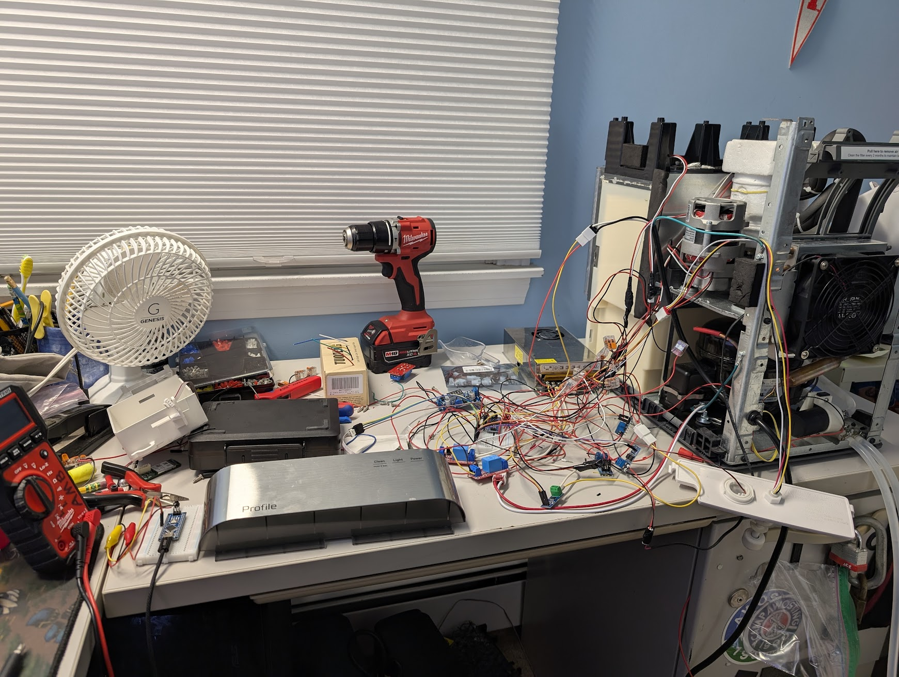

# GE-Opal-Reverse-Engineering-Project

This repository documents, all my attempts to make the GE Opal 2 not kill itself
(More specifically, the *GE Profile:tm: Opal:tm: 2.0 Ultra Nugget Ice Maker )

Important context to a lot of frustration here: This is a $500 dollar ice machine. It has a lifespan of 6 months to 1 year

## The Prototype



> [!WARNING]  
> Schematics and code are not final or tested yet.

### LLM Policy and usage in this project:

- I did **NOT** copy-paste code or otherwise use LLM generated material in this project's code.
- An LLM was used to help me understand how to use KiCAD because I have never used it before.
- An LLM was used to sanity check ([rubber ducky](https://en.wikipedia.org/wiki/Rubber_duck_debugging)) to avoid killing the machine.
- An LLM was used to help me understand the basics of I2C and reverse engineer the communication the Opal uses.
  - **I** implemented the I2C communications in the firmware.

The 2 calibration values where I used an LLM in the firmware are clearly marked.
If you are more skilled with calibration, your (human-made) contributions are welcome!

```cpp
// Calibration factor by gemini, because I hate complex math
const double AugerAmmeterCalibrationFactor = 5.76;
// IRM sample count by Gemini, because I can't be bothered.
const int AugerAmmeterSampleCount = 1480;
```

Do **NOT** submit LLM generated issues, PRs, or use this repo in training data.

### My blog post on this

[A Scathing Review of the GE Opal 2 Nugget Ice Maker](https://blog.aspy.dev/a-scathing-review-of-the-ge-opal-2-nugget-ice-maker/)

# Background

I've tried putting lubrication on the auger ([./squeakFromShaft.md](./squeakFromShaft.md)) but it did not resolve the squeaking issue
I've decided I am going to replace the PCB with an arduino to implement a proper defrost cycle.

## Notice

As I was writing this, Reddit decided to delete the 2 year old post I was using as a reference.
Some of the more important images are available in ./images
https://web.archive.org/web/20250804095737/https://www.reddit.com/r/IceChewersAnonymous/comments/1hxlbkg/fixing_the_opal_20/

## The Problem

The GE Opal ice maker has well-known issues where it will start to fail after about a year of use, and in some cases, prior.
The machine is incredibly high maintenance, [with GE recommending running bleach through the machine](https://products.geappliances.com/appliance/gea-support-search-content?contentId=000060634) ([archive.org capture](https://web.archive.org/web/20260716162758/https://products.geappliances.com/appliance/gea-support-search-content?contentId=000060634))

There is even (as of writing) [an ongoing class action](https://classlawdc.com/2026/01/21/ge-profile-opalnugget-ice-maker-series-1-0-and-2-0-defective-product-investigation/)

These machines do not fail gracefully, often making screeching and whining noises due to the internal parts getting frozen and locked up. This commonly involves the destruction of the gearbox, auger, and/or bearings.

Browsing Reddit reveals many owners have constant issues with these machines, with one redditor even claiming to go through 4 machines in 2 years. Despite its flaws, this machine is well liked by r/IceChewersAnonymous, though they also agree that it has significant longevity issues. [A quick search shows the love/hate the community has for it.](https://www.reddit.com/r/IceChewersAnonymous/search/?q=opal+2)

More importantly, several members of the community have taken attempts to repair the machine pretty far.

- https://www.reddit.com/r/IceChewersAnonymous/comments/1ophadu/opal_20_repair_update/
- https://www.reddit.com/r/IceChewersAnonymous/comments/1hxlbkg/fixing_the_opal_20/
- https://www.reddit.com/r/IceChewersAnonymous/comments/159ts6e/ge_opal_20_add_water_fix/

# Piping


# Nominal voltages recorded from the opal 2 ice maker during operation

| Part                    | Connector Type          | Voltage  |
| ----------------------- | ----------------------- | -------- |
| UV Light                | JST XH 2-pin connector  | 12V DC   |
| Compressor              | JST VHR 3-pin connector | 120V AC  |
| Auger Motor             | JST VHR 3-pin connector | 120V AC  |
| Pump                    | JST XH 2-pin connector  | 12V DC   |
| Fan                     | JST XH 2-pin connector  | 12V DC   |
| WiFi Board              | TBD (5 pins)            | TBD      |
| Front Panel             | TBD (4 pins)            | 5V + I2C |
| Ice Box LED             | JST XH 2-pin connector  | 5V DC    |
| Ice box presence switch | JST XH 2-pin connector  | 5V DC    |
| Internal Tank Floats    | JST XH 4-pin connector  | 5V DC    |
| IR LED For Capacity     | JST XH 2-pin connector  | 5V DC    |
| IR Receiver             | JST XH 2-pin connector  | 5V DC    |
| AC Input                | JST VHR 3-pin connector | 120V AC  |

- I2C protocols documented in [./i2c.md](./i2c.md)

- Internal Tank Floats (4 wires, 2 floats)
  - Black & Red: Lower float (float low = closed circuit)
  - Yellow & White: Upper float (float high = closed circuit)
