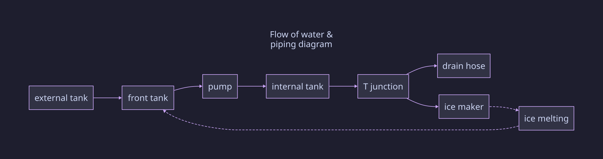

# ON HOLD

## NOT ABANDONED

Awaiting parts

Using the ACS712 to measure only current has proved unhelpful in recognizing when the motor is struggling.
I have ordered some HLW8032 modules, but they won't be here until the end of the month.

# GE-Opal-Reverse-Engineering-Project

This repository documents, all my attempts to make the GE Opal 2 not kill itself
(More specifically, the *GE Profile:tm: Opal:tm: 2.0 Ultra Nugget Ice Maker )

Important context to a lot of frustration here: This is a $500 dollar ice machine. It has a lifespan of 6 months to 1 year

## Consider sponsoring

I have quite literally dumped hundreds of dollars into this project.
Some of the costs are prototyping modules, connectors, electronics components, and OEM parts for the machine.

**Money spent on this project so far: $544.65**
_this does not factor in my time spent on the project_

## Directory

- [`reverse-engineering-efforts/`](./reverse-engineering-efforts) - Generally contains specifics about the hardware of the Opal 2
  - [`i2c.md`](./reverse-engineering-efforts/i2c.md) - Details of the I2C implementation in the original machine
  - [`pipes.d2`](./reverse-engineering-efforts/i2c.md) - D2 file for generating `pipes.svg`
  - [`pipes.svg`](./reverse-engineering-efforts/pipes.svg) - How the Opal 2 is plumbed
- [`physical-repairs/`](./physical-repairs) - Details of specific repair efforts
  - [`gearboxRepair.md`](physical-repairs/gearboxRepair.md) - Details about the gearbox and the procedures and parts to fix it
  - [`squeakFromShaft.md`](physical-repairs/squeakFromShaft.md) - Details about a repair attempting to stop the squeaking shaft
- [`custom-pcb/`](./custom-pcb) - PCB related stuff
  - [`prototype/`](./custom-pcb/prototype) - Details the rough prototype build with modular components before the PCB fabrication
    - [`kicadSchematic/`](./custom-pcb/prototype/kicadSchematic) - Directory containing the KiCAD files for the prototype schematic.
    - [`prototype-parts.md`](./custom-pcb/prototype/prototype-parts.md) - A list of the exact modules I used for prototyping
    - [`SchematicExport.pdf`](./custom-pcb/prototype/SchematicExport.pdf) - A human readable version of the schematic, made by printing to PDF from KiCAD
- [`attribution.md`](./attribution.md) - Links and references used for files
- [`todo.md`](./todo.md) - List of further reseach needed

## To Do

(in no specific order)

- [ ] Finish connectors.md with colors and diagrams
- [ ] Design PCB
- [ ] Reverse engineer I2C bus of other front panel [(Need parts)](./todo.md)
- [ ] Design full independent schematic
- [ ] Reverse engineer GE implementation of the RGB light [(Need parts)](./todo.md)

## Default button mappings

A few new button actions are defined, and a few changed from the original machine behavior

- **Power**: Toggles Power
  - **When held**: Triggers a hard reset of the Arduino. _I hope you know what you're doing_
- **Light**: Toggles Light
- **Clean**: Toggles cleaning mode. In my implentation, there is no timer or anything. It simply forces the pump to run until it is pressed again.

**The light setting is stored in the Arduino's EEPROM.**

[The Arduino's EEPROM has a limited lifespan of 100,000 writes.](https://en.wikipedia.org/wiki/EEPROM#:~:text=An%20EEPROM%20has%20a%20limited%20life%20for%20erasing%20and%20reprogramming) So don't go spamming it. As long as you don't press it 100 times a day (which still comes out to about 3 years of use), it should outlast the machine itself.

_Fun fact: EEPROM (and all flash storage) utilize Quantum Tunneling to store data.
Isn't that cool?_

## The Prototype

> [!WARNING]  
> Schematics and code are not final!

### LLM Policy and usage in this project:

I hate LLMs, and "AI" crap. Therefore, I decided to very clearly define how they were used in this project.

- I did **NOT** copy-paste code or otherwise use LLM generated material in this project's code.
- An LLM was used to help me understand how to use KiCAD because I have never used it before.
- An LLM was used to sanity check ([rubber ducky](https://en.wikipedia.org/wiki/Rubber_duck_debugging)) to avoid killing the machine.
- An LLM was used to help me understand the basics of I2C and reverse engineer the communication the Opal uses.
  - **I** implemented the I2C communications in the firmware.

Do **NOT** submit LLM generated issues, PRs, or use this repo in training data.

You **MAY** submit an **issue** that you made with the assistance of an LLM, but you must **paraphrase and understand** the content in your own words.

### My blog post on this

[A Scathing Review of the GE Opal 2 Nugget Ice Maker](https://blog.aspy.dev/a-scathing-review-of-the-ge-opal-2-nugget-ice-maker/)

# Background

I've tried putting lubrication on the auger ([`squeakFromShaft.md`](./physical-repairs/squeakFromShaft.md)) but it did not resolve the squeaking issue
I've decided I am going to replace the PCB with an arduino to implement a proper defrost cycle.

## Notice

As I was writing this, Reddit decided to delete the 2 year old post I was using as a reference.
Some of the more important images are available in [`images`](./images).

<https://web.archive.org/web/20250804095737/https://www.reddit.com/r/IceChewersAnonymous/comments/1hxlbkg/fixing_the_opal_20/>

## The Problem

The GE Opal ice maker has well-known issues where it will start to fail after about a year of use, and in some cases, prior.
The machine is incredibly high maintenance, [with GE recommending running bleach through the machine](https://products.geappliances.com/appliance/gea-support-search-content?contentId=000060634) ([archive.org capture](https://web.archive.org/web/20260716162758/https://products.geappliances.com/appliance/gea-support-search-content?contentId=000060634))

There is even (as of writing) [an ongoing class action](https://classlawdc.com/2026/01/21/ge-profile-opalnugget-ice-maker-series-1-0-and-2-0-defective-product-investigation/)

These machines do not fail gracefully, often making screeching and whining noises due to the internal parts getting frozen and locked up. This commonly involves the destruction of the gearbox, auger, and/or bearings.

Browsing Reddit reveals many owners have constant issues with these machines, with one redditor even claiming to go through 4 machines in 2 years. Despite its flaws, this machine is well liked by r/IceChewersAnonymous, though they also agree that it has significant longevity issues. [A quick search shows the love/hate the community has for it.](https://www.reddit.com/r/IceChewersAnonymous/search/?q=opal+2)

More importantly, several members of the community have taken attempts to repair the machine pretty far.

- https://www.reddit.com/r/IceChewersAnonymous/comments/1ophadu/opal_20_repair_update/
- https://www.reddit.com/r/IceChewersAnonymous/comments/1hxlbkg/fixing_the_opal_20/
- https://www.reddit.com/r/IceChewersAnonymous/comments/159ts6e/ge_opal_20_add_water_fix/

# Piping

# Nominal voltages recorded from the opal 2 ice maker during operation

_I am aware that XHB is not a real standard. However, this is the bastardized cloned modification China has made. it is a JST XH connector with a locking tab. You will not find them on Amazon, or Digikey. I found mine [on Aliexpress](https://www.aliexpress.us/item/3256812673164043.html?spm=a2g0o.order_detail.order_detail_item.3.7c9d126ahviqlg&gatewayAdapt=glo2usa)._

| PCB Label     | Part                    | Connector Type & Color           | Voltage      |
| ------------- | ----------------------- | -------------------------------- | ------------ |
| UV            | UV Light                | JST XHB 2-pin connector (Blue)   | 12V DC       |
| compressor    | Compressor              | JST VHR 3-pin connector (Red)    | 120V AC      |
| motor         | Auger Motor             | JST VHR 3-pin connector (White)  | 120V AC      |
| WP            | Pump                    | JST XHB 2-pin connector (Purple) | 12V DC       |
| FAN1          | Fan                     | JST XHB 2-pin connector (Gray)   | 12V DC       |
| WIFI          | WiFi Board              | JST XHB 5-pin connector (White)  | 3.3V + 5V DC |
| IM1101        | Front Panel             | JST XHB 4-pin connector (Black)  | 5V + I2C     |
| LED11 & LED12 | Ice Box LED(s?)         | JST XHB 2-pin connector (White)  | 12V DC       |
| SW            | Ice box presence switch | JST XHB 2-pin connector (Red)    | 5V DC        |
| CON5          | Internal Tank Floats    | JST XHB 4-pin connector (Red)    | 5V DC        |
| TX            | IR LED For Capacity     | JST XHB 2-pin connector (Yellow) | 5V DC        |
| RX            | IR Receiver             | JST XHB 2-pin connector (Green)  | 5V DC        |
| AC            | AC Input                | JST VHR 3-pin connector (Black)  | 120V AC      |
| IMN1001       | ???                     | JST XHB 7-pin connector (White)  | ???          |
| CON6          | ???                     | JST XHB 6-pin connector (White)  | 5V + ???     |
| Clean         | ???                     | JST XHB 2-pin connector (Cyan)   | ???          |
| RGB           | ???                     | JST XHB 3-pin connector (White)  | 5V + ???     |
| 1033          | ???                     | JST XHB 3-pin connector (Black)  | 5V + ???     |
| CON3          | ???                     | JST XHB 3-pin connector (Red)    | ???          |
| ???           | ???                     | JST XHB 5-pin connector (Black)  | 5V + ???     |

- I2C protocols documented in [`i2c.md`](./reverse-engineering-efforts/i2c.md)

- Internal Tank Floats (4 wires, 2 floats)
  - Black & Red: Lower float (float low = closed circuit)
  - Yellow & White: Upper float (float high = closed circuit)
