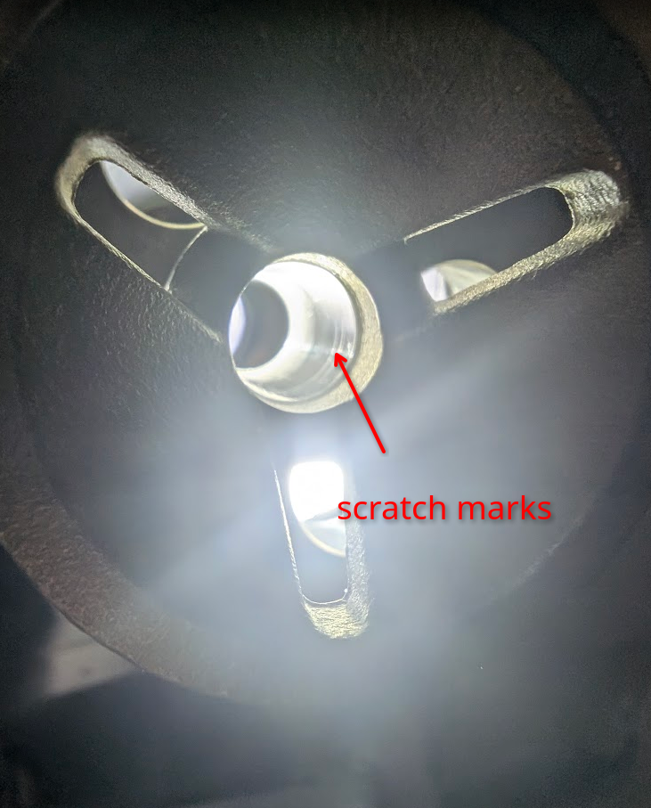
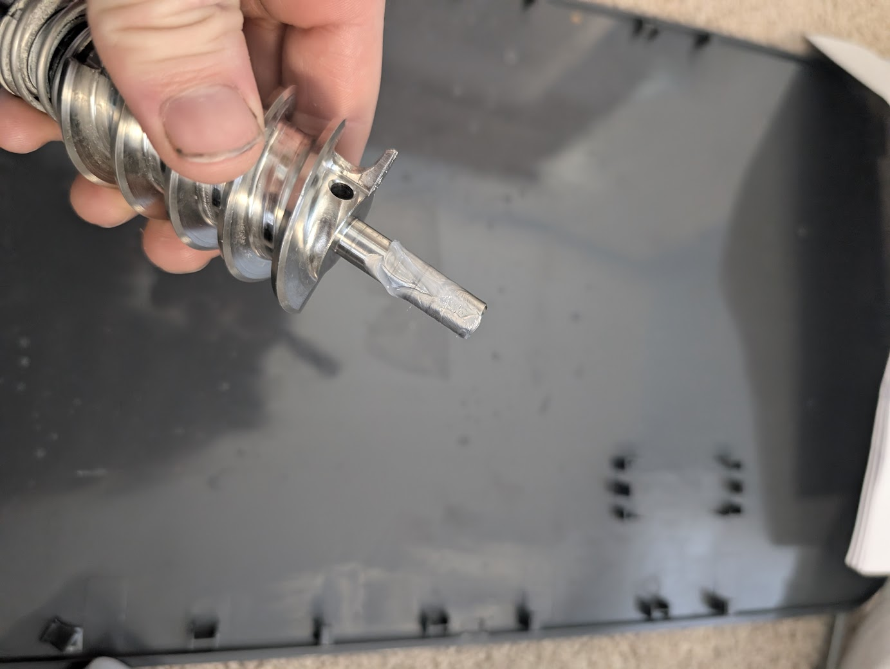
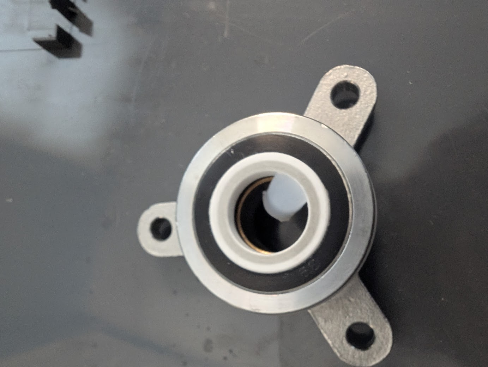
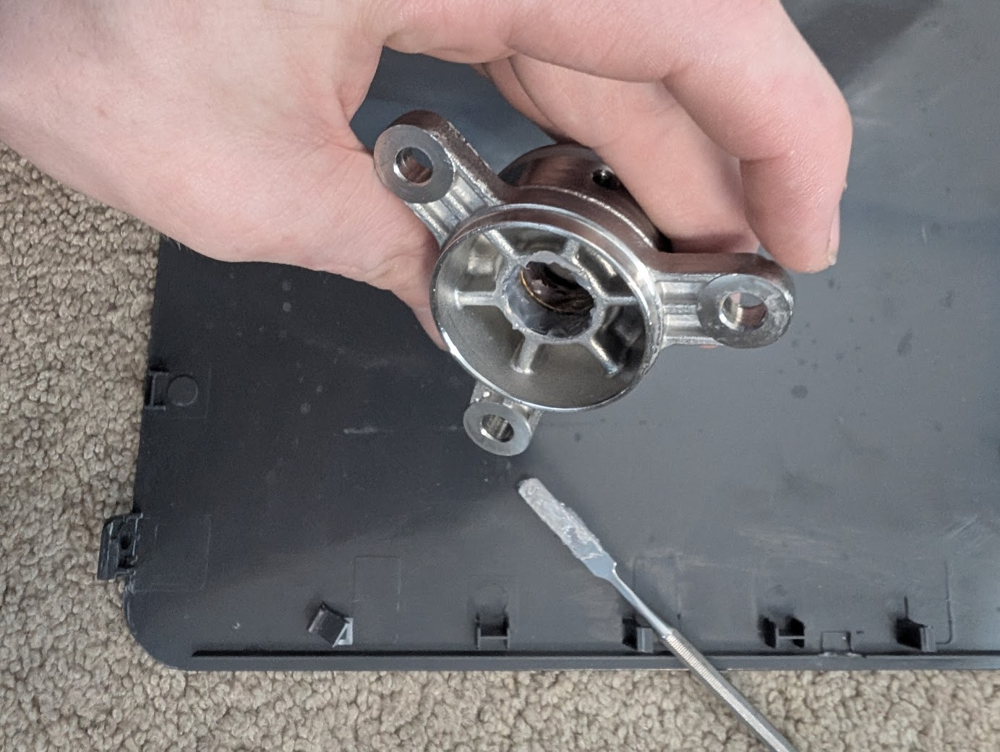

# Attempted fix for the auger shaft sqeaking

After my machine started making noise, I determined it seemed to be coming from where the shaft of the auger meets the housing.

The housing at the top of the auger appears to have a plastic bushing, which in my case seemed in bad shape

I attempted to remove the plastic bushing, to attempt replacing it with a proper bearing but was unable to get it out.

I ended up just applying [Super Lube 21030 Synthetic Multi-Purpose Grease](https://www.amazon.com/dp/B000XBH9HI) to the top and the bushing at the bottom of the shaft.

Before applying new grease, make sure you remove all the old grease first (if there is any)
This is also a good time to inspect the auger and housing for damage/scale. In my case scale usually looked like a white powder that could be easily removed with a cloth.

You should spread the grease, so you dont have a big blob that will just be scraped off when its inserted.
You can do it with your fingers or a small tool.

