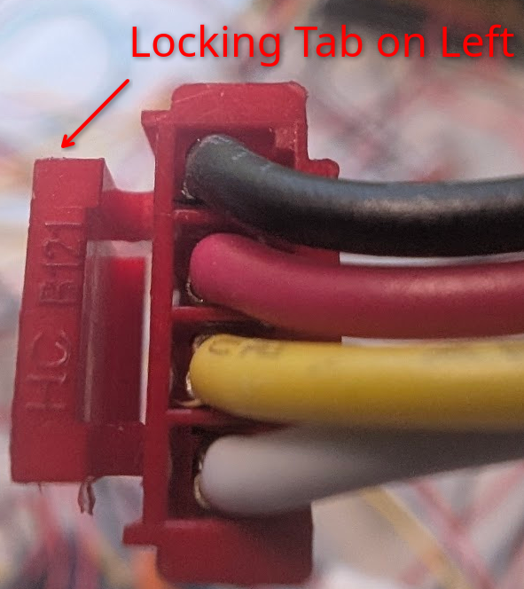

# Connectors

## How to use this information

Assume you are looking down the connector from above, with the locking tab on the left.

Wires are listed in the order they appear.

This would be listed like

- Black
- Red
- Yellow
- White

> [!WARNING]  
> **CHECK EVERY WIRE. GE IS NOT CONSISTENT IN WIRE COLOR CODING.**
>
> You are probably better off only referring to connectors by the alignment of the wires in reference to the locking tab rather than color
> _For example, the IR Receiver and IR Blaster both have Red and White wires, but the polarity is reversed on one._

### AC Header (Black)

JST VHR 3-pin connector (No center pin)

- LINE (Black)
- N/A
- NEUTRAL (White)

### Compressor Header (Red)

JST VHR 3-pin connector (No center pin)

- NEUTRAL (White)
- N/A
- LINE (Red)

### Motor Header (White)

JST VHR 3-pin connector (No center pin)

- NEUTRAL (Red)
- N/A
- LINE (Black)

### UV Header (Blue)

JST XHB 2-pin connector

- 12V DC
- GND

### IR Receiver (Green)

JST XHB 2-pin connector

- GND (Red)
- 5V DC (White)

### IR Blaster (Yellow)

JST XHB 2-pin connector

- GND (White)
- 5V DC (Red)

### UV LED (Orange)

JST XHB 2-pin connector

- 12V DC (Red)
- GND (Black)

### Fan (Gray)

JST XHB 2-pin connector

- GND (Black)
- 12V DC (Red)

### Pump (Purple)

JST XHB 2-pin connector

- GND (Black)
- 12V DC (Red)

### Bin Switch (Red)

JST XHB 2-pin connector

(Being a switch, polarity isn't neccesarily relevant.)

- 5V DC (White)
- GND (Red)

## Water Level Floats (Red)

JST XHB 4-pin connector

(Being a switch, polarity isn't neccesarily relevant.)

When the LOWER FLOAT is LOW the circuit is CLOSED.
When the UPPER FLOAT is HIGH the circuit is CLOSED.

Ex:

tank empty = Upper Float OPEN, Lower Float CLOSED

tank full = Upper Float CLOSED, Lower Float OPEN

- Lower Float GND (Black)
- Lower Float 5V DC (Red)
- Upper Float ???? (Yellow)
- Upper Float ???? (White)
